# How to Onboard with Kubernetes

**Kubernetes** is a tool that helps you to manage containerized applications. It automates the deployment, scaling, and operations and handles the lifecycle.

In that guide, we'll go though many things starting from the containers, then exploring Kubernetes, and at the end, we'll see a bit of Helm charts.

So mainly, kubernetes is devided into two main parts:
- administration
- application deployment

The admin part is reserved to people who manage the cluster.
In another hand, the application deployment is for developers who want to deploy their applications on the cluster.

In that tutorial, we'll see both parts but with more focus on the application deployment.

## How to setup a kubernetes cluster (locally)

But before setting up our cluster, let's see the different solutions that exist to run kubernetes.
(PS: this is not an exhaustive list, just the most known ones)


| Project              | Derived from / Uses                       | Notes                                                                                   |
| -------------------- | ----------------------------------------- | --------------------------------------------------------------------------------------- |
| **kubeadm**          | Upstream Kubernetes                       | Official bootstrapper for vanilla clusters.                                             |
| **k3s**              | Recompiled from upstream Kubernetes       | Removes alpha features, uses sqlite by default, swaps components (flannel, containerd). |
| **MicroK8s**         | Upstream Kubernetes                       | Built and packaged by Canonical as a snap; not a rewrite.                               |
| **k0s**              | Reimplementation around upstream APIs     | Uses kubelet/kube-proxy binaries but replaces bootstrap/init logic.                     |
| **RKE2**             | Based on upstream, hardened by Rancher    | Follows k3s design but full-featured, FIPS-ready.                                       |
| **Talos Linux**      | Runs upstream binaries on an immutable OS | Focus on security and OS–K8s integration.                                               |
| **kind**             | Uses upstream binaries in containers      | Exactly what Kubernetes CI runs on.                                                     |
| **minikube**         | Uses kubeadm internally                   | Adds driver abstraction (VM, Docker, Podman).                                           |
| **k3d**              | Runs k3s in Docker                        | Thin wrapper around k3s.                                                                |
| **Rancher Desktop**  | Runs k3s or k8s via Lima/VM               | GUI environment for developers.                                                         |
| **kOps / Kubespray** | Use kubeadm or upstream binaries          | Automate lifecycle, not distros.                                                        |
| **GKE / EKS / AKS**  | Directly fork upstream Kubernetes         | Add proprietary integration (IAM, LB, storage).                                         |

The initial project of kubernetes has been created by Google, and now it's maintained by CNCF (Cloud Native Computing Foundation). It includes many repos like:
- kubernetes/kubernetes: the main repo
- kubernetes/minikube: to run a local kubernetes cluster
- kubernetes/kubeadm: to bootstrap a kubernetes cluster
- kubernetes/ingress-nginx: to manage ingress in kubernetes
- kubernetes/helm: to manage helm charts
---
Here is a Mermaid diagram showing the relation between some of the projects:

```mermaid
flowchart TB
    %% ====== ANCHORS (invisible, to control layout) ======
    A_TOP(( )):::ghost
    A_LEFT(( )):::ghost
    A_RIGHT(( )):::ghost
    A_BL(( )):::ghost
    A_BR(( )):::ghost

    %% Center
    K8S["🎯 Kubernetes (Upstream / CNCF Core)"]:::core

    %% Anchor geometry (forces a square-ish layout)
    A_TOP --> K8S --> A_BL
    A_LEFT --> K8S --> A_RIGHT
    K8S --> A_BR

    %% ====== OFFICIAL TOOLS (TOP) ======
    subgraph OFFICIAL["Official Tools"]
      direction TB
      OFFT[Official]
      KUBEADM["kubeadm · official bootstrap"]:::official
      KIND["kind · upstream-in-docker (CI)"]:::official
      MINI["minikube · local wrapper around kubeadm/drivers"]:::official
      OFFT --> KUBEADM
      OFFT --> KIND
      KUBEADM --> MINI
    end
    A_TOP --> OFFT
    K8S --> KUBEADM
    K8S --> KIND

    %% ====== COMMUNITY DISTROS (LEFT) ======
    subgraph DISTROS["Community Distributions"]
      direction TB
      DISTT[Distributions]
      K3S["k3s · lightweight rebuild (Rancher/SUSE)"]:::distro
      RKE2["RKE2 · hardened (CIS/FIPS)"]:::distro
      MICROK8S["MicroK8s · Canonical snap build"]:::distro
      K0S["k0s · minimal (Mirantis)"]:::distro
      TALOS["Talos Linux · immutable OS + upstream K8s"]:::distro
      DISTT --> K3S
      K3S --> RKE2
      DISTT --> MICROK8S
      DISTT --> K0S
      DISTT --> TALOS
    end
    A_LEFT --> DISTT
    K8S --> K3S
    K8S --> MICROK8S
    K8S --> K0S
    K8S --> TALOS

    %% ====== LOCAL WRAPPERS (RIGHT) ======
    subgraph LOCAL["Wrappers & Local Runtimes"]
      direction TB
      LOCT[Local]
      K3D["k3d · runs k3s in Docker"]:::tool
      RD["Rancher Desktop · GUI using k3s"]:::tool
      DD["Docker Desktop (K8s) · VM with upstream binaries"]:::tool
      LOCT --> K3D
      LOCT --> RD
      LOCT --> DD
    end
    A_RIGHT --> LOCT
    K3S --> K3D
    K3S --> RD
    MICROK8S --> DD

    %% ====== INFRA / INSTALLERS (BOTTOM-LEFT) ======
    subgraph INFRA["Cluster Lifecycle / Installers"]
      direction TB
      INFT[Infra]
      KOPS["kOps · AWS-focused lifecycle manager"]:::infra
      KSPRAY["Kubespray · Ansible-based installer"]:::infra
      INFT --> KOPS
      INFT --> KSPRAY
    end
    A_BL --> INFT
    K8S --> KOPS
    K8S --> KSPRAY

    %% ====== MANAGED CLOUDS (BOTTOM-RIGHT) ======
    subgraph CLOUD["Managed Cloud Services"]
      direction TB
      CLDT[Managed]
      GKE["GKE · Google-managed upstream"]:::cloud
      EKS["EKS · AWS-managed upstream"]:::cloud
      AKS["AKS · Azure-managed upstream"]:::cloud
      CLDT --> GKE
      CLDT --> EKS
      CLDT --> AKS
    end
    A_BR --> CLDT
    K8S --> GKE
    K8S --> EKS
    K8S --> AKS

    %% ====== STYLES ======
    classDef core fill:#1f2937,stroke:#0ea5e9,stroke-width:2px,color:#fff
    classDef official fill:#0f766e,stroke:#064e3b,color:#fff
    classDef distro fill:#2563eb,stroke:#1e3a8a,color:#fff
    classDef tool fill:#f59e0b,stroke:#92400e,color:#111
    classDef infra fill:#15803d,stroke:#14532d,color:#fff
    classDef cloud fill:#7c3aed,stroke:#4c1d95,color:#fff
    classDef ghost fill:transparent,stroke:transparent
```



### **Legend**

| Color             | Category                   | Description                                                                             |
| ----------------- | -------------------------- | --------------------------------------------------------------------------------------- |
| 🩵 **Blue-gray**  | **Core**                   | Upstream Kubernetes project (CNCF).                                                     |
| 🟩 **Green**      | **Official tools**         | Built and maintained by Kubernetes SIGs (e.g., kubeadm, kind, minikube).                |
| 🔵 **Blue**       | **Community distros**      | Rebuilt versions of Kubernetes (k3s, MicroK8s, k0s, RKE2, Talos).                       |
| 🟧 **Orange**     | **Local wrappers**         | Developer-friendly runtimes using those distros (k3d, Rancher Desktop, Docker Desktop). |
| 🟢 **Dark green** | **Lifecycle / installers** | Tools to deploy/manage upstream Kubernetes (kOps, Kubespray).                           |
| 🟣 **Purple**     | **Managed clouds**         | Vendor-hosted clusters built from upstream (GKE, EKS, AKS).                             |


---

## How to install minikube (local kubernetes cluster)

### Prerequisites
- A compatible hypervisor (like VirtualBox, HyperKit, KVM, etc.) or Docker installed on your machine.
Run the command below to check if your CPU supports virtualization:
```bash
grep -E --color 'vmx|svm' /proc/cpuinfo
```

### Installation

For the purpose of that tutorial, we'll use **minikube** to run a local kubernetes cluster.
Here is the official documentation to install minikube: https://minikube.sigs.k8s.io/docs/start/

**If you need to update minikube**, you can run the following command:
```bash
minikube update-check
# If an update is available, run:
rm -rf $(which minikube)
# and then reinstall following the installation instructions.
```

Set autocomplete for minikube (optional):
```bash
source <(minikube completion bash)  # for bash users
# Save it to your bashrc/zshrc to load it automatically on terminal start
echo 'source <(minikube completion bash)' >> ~/.bashrc
```

### Starting minikube (with Docker driver)
To start a local kubernetes cluster using minikube, run the following command:
```bash
minikube start --driver=docker

# Check the status of the cluster
minikube status

# Get cluster info
minikube kubectl -- cluster-info
```

As you can see, minikube provides a built-in way to run kubectl commands using `minikube kubectl -- <command>`. But normally, you'll have to install kubectl separately to interact with the cluster.

This is what we'll see in the next section.

### Good to know
Minikube also provides a usefull web dashboard to monitor your cluster. You can access it by running:
```bash
minikube dashboard
```


Other commands that can be useful:
```bash
# pause the cluster
minikube pause

# resume the cluster
minikube unpause

# To stop the cluster
minikube stop

# To delete the cluster
minikube delete
```

You can also create several profiles (clusters) with minikube by using the `-p` flag:
```bash
minikube start -p cluster2 --driver=docker
minikube profile list
|----------|-----------|---------|--------------|------|---------|---------|-------|----------------|--------------------|
| Profile  | VM Driver | Runtime |      IP      | Port | Version | Status  | Nodes | Active Profile | Active Kubecontext |
|----------|-----------|---------|--------------|------|---------|---------|-------|----------------|--------------------|
| cluster2 | docker    | docker  | 192.168.58.2 | 8443 | v1.31.0 | Running |     1 |                | *                  |
| minikube | docker    | docker  | 192.168.49.2 | 8443 | v1.31.0 | Running |     1 | *              |                    |
|----------|-----------|---------|--------------|------|---------|---------|-------|----------------|--------------------|

# To switch between profiles
minikube profile cluster2

# To delete a specific profile
minikube delete -p cluster2

# or delete all profiles
minikube delete --all
```

## How to install kubectl (kubernetes client tool)


